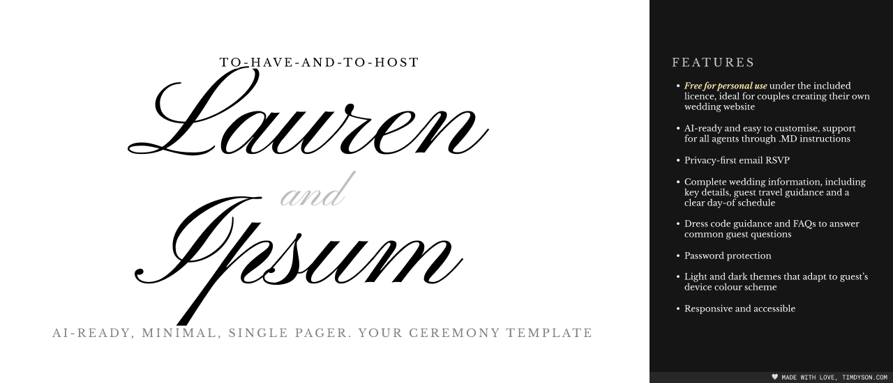

# To Have and To Host

A polished, single-page wedding website template built with Astro and designed for private, mobile-first sharing.

The template includes an editorial visual system, light and dark themes, sticky section chips, a password gate for casual privacy, configurable map links, and an RSVP flow that prepares an email without storing guest responses.

## Before adding personal information

Create your own **private** GitHub repository from this template. Confirm that it is private before adding names, dates, addresses, email addresses, photographs, or other wedding details. Check the repository visibility again before deployment.

Do not commit passwords, guest lists, RSVP responses, private documents, or plaintext secrets.

## What is included

- One continuous, responsive wedding page
- Sticky chips for Details, Schedule, Travel, Dress code, RSVP, and FAQs
- Light, dark, and system theme modes
- Central content configuration in `src/data/site.ts`
- Google Maps and Apple Maps destinations
- Static email-based RSVP with a copy-response fallback
- Client-side password gate enabled by default
- `noindex` metadata, restrictive `robots.txt`, and Vercel indexing headers
- Progressive, resumable setup instructions for people and AI coding assistants
- Two configurable, responsive image slots with documented source and alt-text guidance
- No analytics, guest database, hosted form service, or third-party embed

## Start here

1. Make a private copy of this repository.
2. Install Node.js 22.19 or newer, then install the locked dependencies with `npm ci`.
3. Open `SETUP.md` and complete one stage at a time.
4. If you are using an AI coding assistant, ask it to: **“Read `SETUP.md` and begin with the first incomplete stage.”**

Your progress is recorded in `SETUP_PROGRESS.md`, so setup can stop and resume without repeating completed decisions.

## Local development

```bash
npm ci
npm run dev
```

When no password hash is configured, the development server uses the demo password `test`. This fallback is development-only and is never included in a production build.

When you are ready to configure your own password, generate a hash:

```bash
npm run password:hash
```

Add the generated hash to a private `.env.local` file:

```text
PUBLIC_SITE_PASSWORD_HASH="your-64-character-sha256-hash"
```

The plaintext password is not saved by the included utility. Vite loads `.env.local` in development too, so the configured password replaces `test` locally. Use `.env.development.local` only when development should use a different hash.

Run the quality checks before publishing:

```bash
npm run check
npm run build
npm audit
```

## Deploy to Vercel

Import the private GitHub repository into Vercel, add `PUBLIC_SITE_PASSWORD_HASH` under Project Settings → Environment Variables, and deploy. Redeploy after changing the hash or any other build-time variable. Set `wedding.metadata.siteUrl` to the final HTTPS origin so canonical and social-preview URLs are absolute.

See `SETUP.md` for a guided deployment and launch review.

## Important privacy limits

The password gate is a client-side convenience intended to prevent casual access. It is not strong authentication. A determined person may inspect the generated website files and public password hash. Use server-side authentication or Vercel deployment protection if your wedding requires stronger access control.

The RSVP form does not send or store a response by itself. It opens the guest’s email application with a prepared message. The guest must send that email to finish their RSVP.

Search indexing is discouraged in several places, but `noindex` is a request to search engines rather than an access-control system.

## Customising the template

Most wedding content is in `src/data/site.ts`. Read `CUSTOMIZE.md` for field-by-field guidance, imagery requirements, and design changes that are safe to make.

The current demo photography is sourced from Unsplash. See [`IMAGE_CREDITS.md`](IMAGE_CREDITS.md) for source links and replacement guidance. Personalised repositories should replace demo images with approved assets and remove stale credits.

## Licence

To Have and To Host is licensed under the [PolyForm Noncommercial License 1.0.0](LICENSE). It is free for personal and other non-commercial use. Commercial use requires separate permission.

This is a source-available licence, not an OSI-approved open-source licence. Anyone redistributing the project must include the licence terms and its required copyright notice.

Release history is recorded in [`CHANGELOG.md`](CHANGELOG.md).

Website design credit defaults to [timdyson.com](https://timdyson.com).
